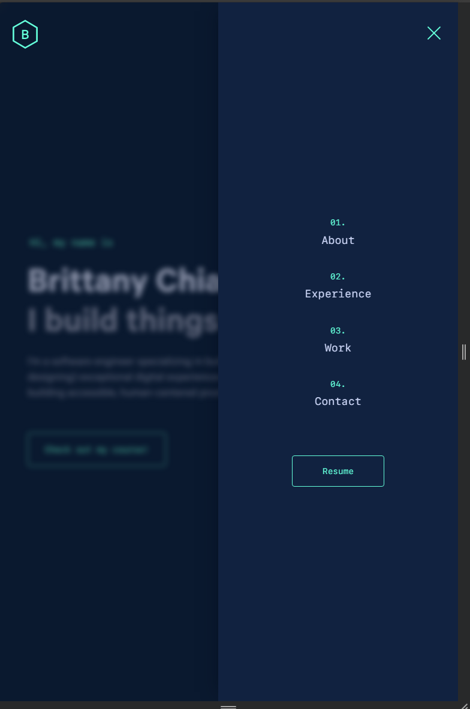
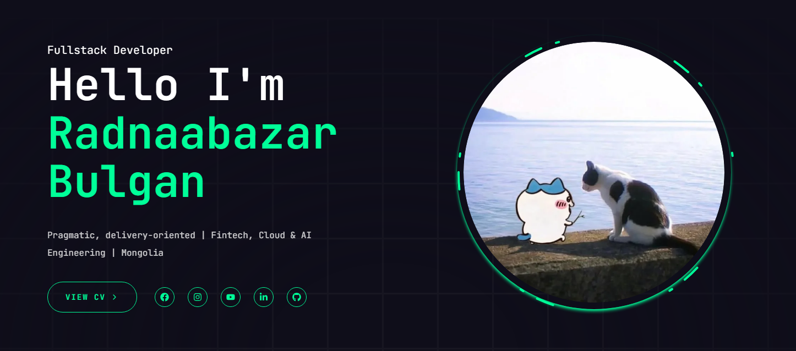
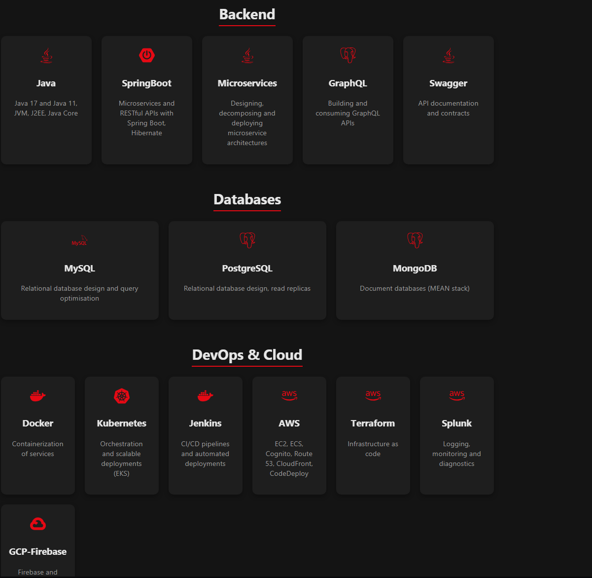
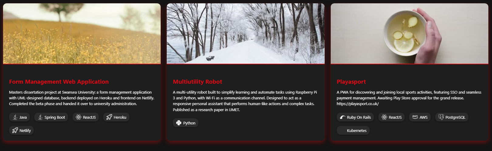
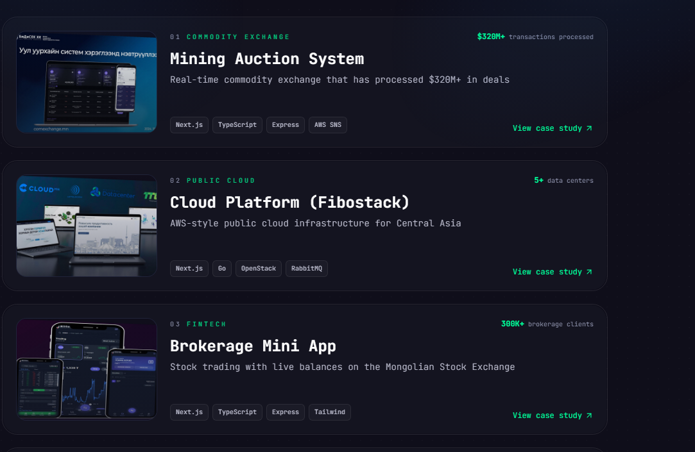
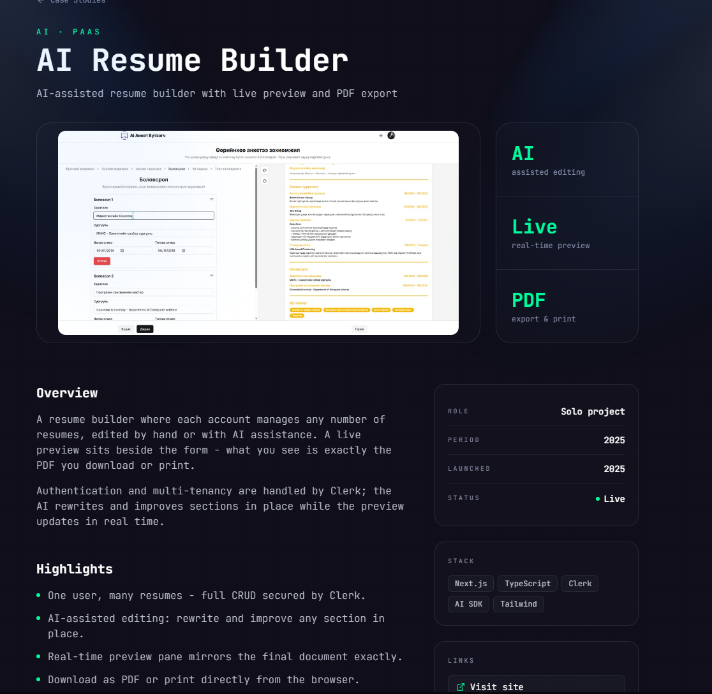
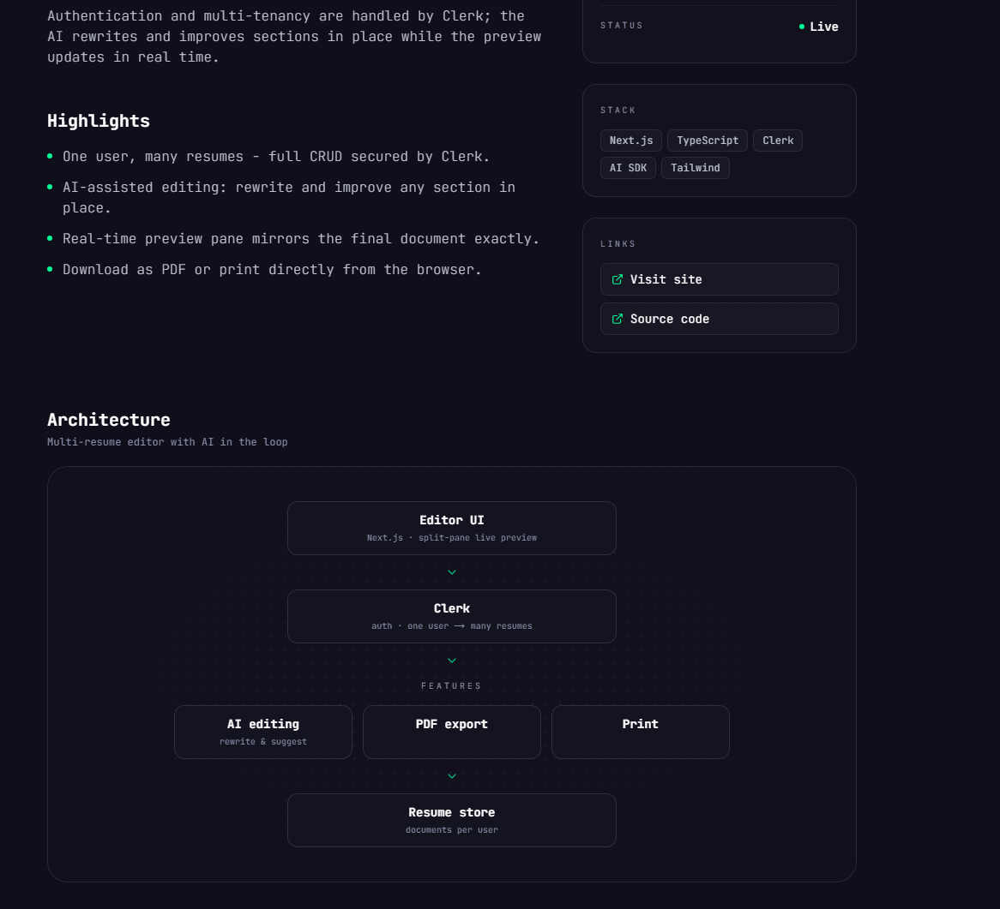

# Plans for new Frontend

## General

- each Core section(Home, Games, Tools, Projects) should have their own colors(shadcn style)
- each Core section should have a unique animation/transition to it
- Every component should be reusable and not hard coded

## Nav

- Nav Bar should have 6 things on it
  - Home(Will be Krish544 or logo on leftmost side)
  - Account
  - Games
  - Tools
  - Projects
  - Resume
- Nav will be stuck to the top of the screen, but be a little translucent
- Steal mobile version of nav bar from https://v4.brittanychiang.com
  
- Whatever is the current page should be highlighted on navbar
- On hover colors should change to Primary color of that section(for Resume again steal the button from https://v4.brittanychiang.com )
- Nav should be background color with a little shadow to tell it's not fully part of page(steal from comet aviation)

## Home

- On inital load of Home page animation of Jolteon getting zapped and turning into plush jolteon
- transition is a 5 star pull animation(probably going to be wuthering waves or genshin impact's) that ends with pulling jolteon plush splash art before clearing for the actual page
- Home should have jolteon colors
- Should have an introduction of myself like https://www.radnaabazar.com/en/personal
- Account related things should follow Home color scheme
- Frontpage should have (in order)
  - Header/Summary of who I am(like https://www.radnaabazar.com/en/personal)
  - About Me
  - Skills
    
  - Projects(Link and display last 4 added projects as vertical card)
    
  - "Want to know more? here's my blog!" -> Link/index of Blog(like https://blog.maximeheckel.com)
  - Contact me(this could also just be footer)
- Account setup doesn't need much changes, but needs TOS to be a react modal and after logging in/registering account needs to send back to page user was at before needing to sign in/register

## Games

- Current Card Setup is fine, but lets remove the Video Part and make the thumbnails change based on light and dark mode
- add some drop shadow thats the primary color of the section and make it bigger/higher opacity on hover like https://sumanthsamala.com/projects
  
- transition to it is gamecube starting intro like this: https://gcintro.toomuchofheaven.com  
  but without the controls and maybe a bit sped up, but getting it working is the priority for now.

## Tools

- Current Card Setup is fine, but lets remove the Video Part and make the thumbnails change based on light and dark mode
- add some drop shadow thats the primary color of the section and make it bigger/higher opacity on hover like https://sumanthsamala.com/projects
  
- transition into tools is everything goes dark then two wires connect and spark and the page becomes visible before the wires go downward

## Projects

- Show each project with a picture of it, a short summary, and shown tech stack exactly like https://www.radnaabazar.com/en/projects
  
  Don't put any of the top right corner stats for card
- Also since these are outside projects each one should have their own little case study like https://www.radnaabazar.com/en/projects/brokerage-mini-app
  - 
  - 
- have it grided on desktop(lg) and just one column on mobile
- Make sure that it's easy to make a new project using the config
- There shouldn't be a separate jsx/tsx file for each project, it should be reusable for each following the eariler shown example barring the parts not explicitly in the projectsConfig.ts file
- transition into projects should be less personalized(since it will also be for each case study) left and right sides curtain close in the color of the primary projects color.
- THESE LOOK DIFFERENT THAN TOOLS AND GAMES

## Footer

- On the bottom of every page below comments
- Social Links
- Contact Information
- Made by Krish Bharal on the bottom of the page

## Reactivity

- it's called React for a reason for anything that is clickable make it change colors on hover or make it pulse or animate in some way
- for non clickables but things that will still be hovered have that move a little, maybe

# To-do List

- change colors for Home dark mode and games dark mode, the light versions are fine
- Remake Nav Bar
- Blog creation(Not for this sprint)
- Footer
- add animation for shadow glow effect on cards
- add border to cards(other than glow)
- personalize home page myself
- add all hover and animations
- Every transition
- add borders to things like comments and login to separate from background
- Remake Accounts page and make TOS a modal instead
